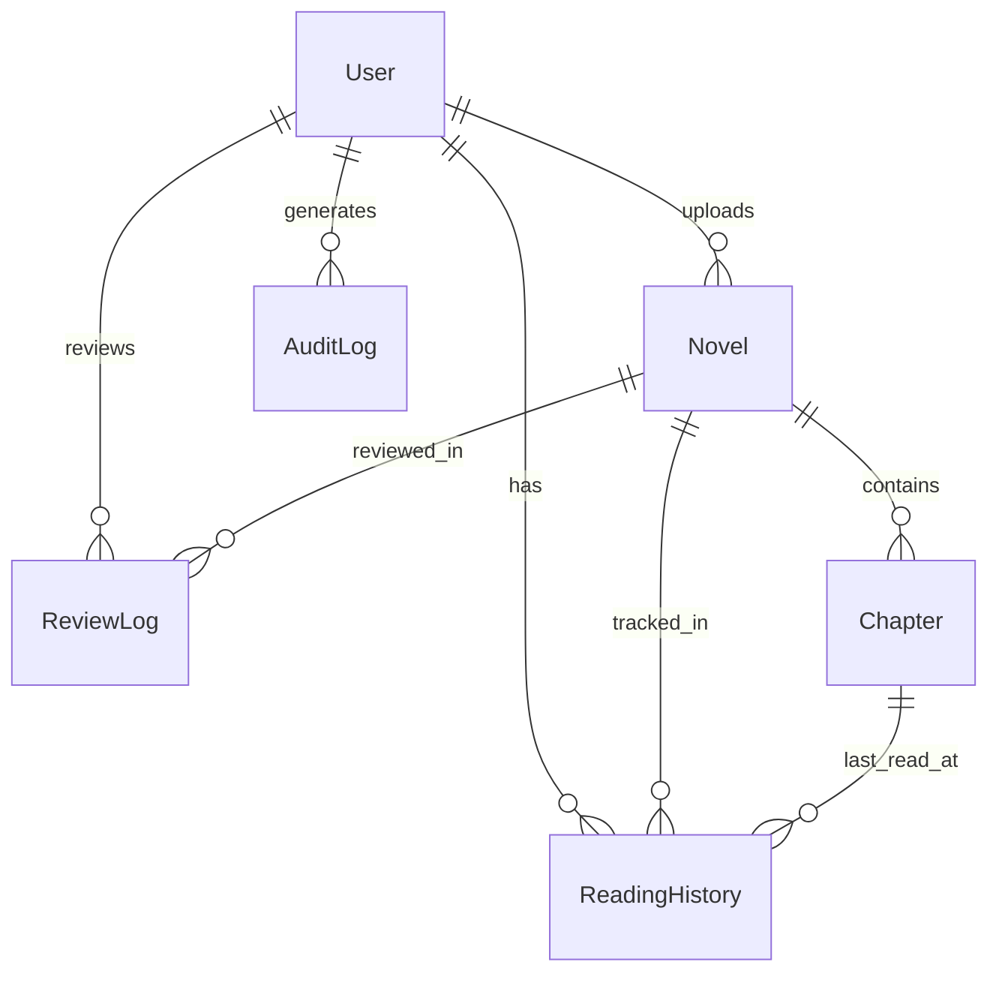

# 数据库设计

## 概述
数据库通过 **Prisma ORM** 进行管理。Schema 定义在 `prisma/schema.prisma` 中。我们目前使用 SQLite 以便由开发和移植（非常适合作为 CTF 靶场），但它完全兼容 PostgreSQL。

## 数据生命周期与流向

### 1. 小说发布生命周期
`Novel` 和 `Chapter` 的状态流转遵循严格的流程：
1.  **DRAFT (草稿)**: 作者创建内容。
2.  **AI_REVIEW (AI 预审)**: 提交后，内容被发送至 `ai-pre-review` 模块。
    *   如果 `pass: true`: 状态 -> `PENDING` (待人工审核)。
    *   如果 `pass: false`: 状态 -> `REJECTED` (自动驳回)。
    *   **数据**: 原始 JSON 分析结果存储在 `Novel.aiReviewRaw` 和 `Novel.aiQuality` 字段中。
3.  **PENDING (待审核)**: 管理员在 `/admin/audit` 界面进行审核。
4.  **PUBLISHED (已发布)**: 内容对读者可见。

### 2. 用户会话生命周期
*   **登录**: 用户通过认证。
*   **活跃**: `User.role` 被缓存在 JWT 中。
*   **撤销**: 当管理员封禁用户 (`status: BANNED`) 时，下次用户客户端刷新会话（通常在页面跳转时），`jwt` 回调会检测到变更并立即使会话失效。

## 实体关系图 (ERD)

核心关系围绕 `User` (用户) 和 `Novel` (小说) 实体展开。

## 数据模型

### 1. User (用户)
代表所有系统用户（读者、作者、管理员）。
- **关键字段**: `email`, `password` (哈希后), `role` (USER, AUTHOR, ADMIN, SUPER_ADMIN), `status` (ACTIVE, BANNED).
- **角色**:
    - `USER`: 阅读小说，管理个人资料。
    - `AUTHOR`: 创建小说，发布章节。
    - `ADMIN`: 审核内容，管理用户。
    - `SUPER_ADMIN`: 系统完全访问权限。

### 2. Novel (小说)
代表一本书/小说实体。
- **关键字段**: `title`, `description`, `coverUrl`, `status` (DRAFT, PUBLISHED 等)。
- **AI 字段**: `aiReviewPassed`, `aiQuality`, `aiReviewRaw` (存储来自 AI 预审的 JSON 分析结果)。
- **审计字段**: `lastSubmittedAt`, `lastApprovedAt`。

### 3. Chapter (章节)
代表小说中的具体章节。
- **关键字段**: `title`, `content` (HTML/文本), `order` (序号)。
- **状态**: 章节拥有独立的生命周期 (`DRAFT` -> `PENDING` -> `PUBLISHED`)。
- **VIP 系统**: `isVip` (布尔值) - 决定章节是否需要订阅/付费（模拟）。

### 4. ReadingHistory (阅读历史)
追踪用户阅读进度。
- **复合键**: `[userId, novelId]` 确保每个用户每本书只有一条记录。
- **关联**: 链接到具体的 `Chapter` 以记忆确切位置。

### 5. ReviewLog (审核日志)
记录人工或 AI 审核的历史。
- **字段**: `reviewerId`, `action` (APPROVE/REJECT), `feedback`。
- **用途**: 责任追踪与作者反馈。

### 6. AuditLog (审计日志)
全系统的安全日志。
- **字段**: `action`, `resource`, `ipAddress`, `userId`。
- **用途**: 追踪关键操作（如封禁用户、删除书籍）。对于 CTF 挑战的“System”类别至关重要。

### 7. GhostMessage (幽灵消息)
用于“幽灵模式” CTF 特性的特殊表。
- **字段**: `content`, `type` (user, system, flag, hint)。
- **用途**: 存储在隐藏聊天/终端界面中显示的消息。
