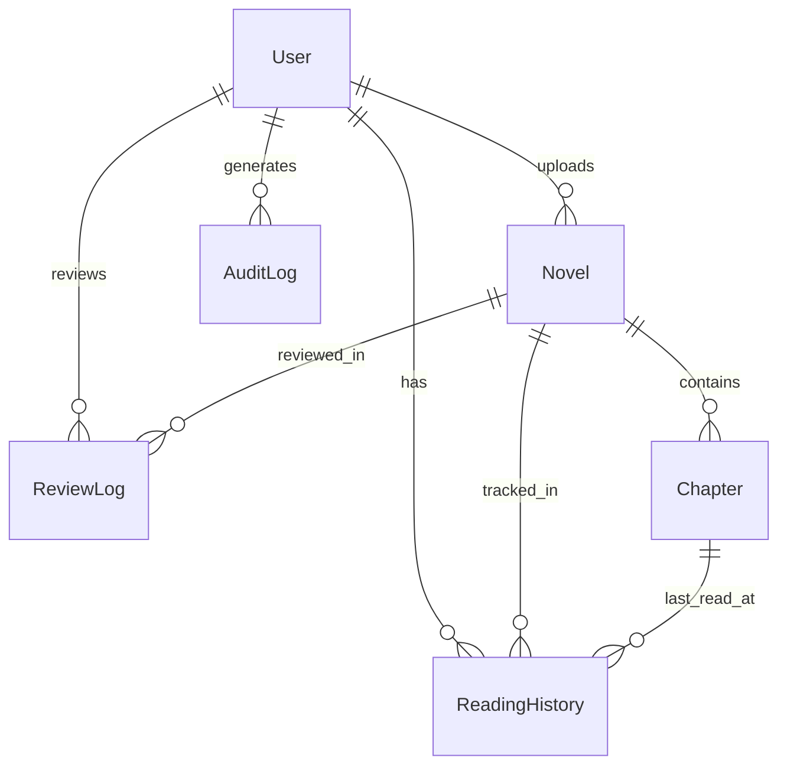

# Database Design

## Overview
The database is managed using **Prisma ORM**. The schema is defined in `prisma/schema.prisma`. We currently use SQLite for ease of development and portability (perfect for a CTF target), but it is fully compatible with PostgreSQL.

## Data Lifecycle & Flows

### 1. Novel Publishing Lifecycle
The `Novel` and `Chapter` status transitions follow a strict flow:
1.  **DRAFT**: Author creates content.
2.  **AI_REVIEW (Internal)**: Upon submission, content is sent to `ai-pre-review`.
    *   If `pass: true`: Status -> `PENDING` (Ready for admin).
    *   If `pass: false`: Status -> `REJECTED` (Auto-rejection).
    *   **Data**: The raw JSON analysis is stored in `Novel.aiReviewRaw` and `Novel.aiQuality`.
3.  **PENDING**: Admin reviews the content in `/admin/audit`.
4.  **PUBLISHED**: Content is visible to readers.

### 2. User Session Lifecycle
*   **Login**: User is authenticated.
*   **Active**: `User.role` is cached in the JWT.
*   **Revocation**: When an Admin bans a user (`status: BANNED`), the next time the user's client refreshes the session (usually on page navigation), the `jwt` callback detects the change and invalidates the session.

## Entity Relationship Diagram (ERD)

The core relationships revolve around the `User` and `Novel` entities.

## Data Models

### 1. User
Represents all system users (Readers, Authors, Admins).
- **Key Fields**: `email`, `password` (hashed), `role` (USER, AUTHOR, ADMIN, SUPER_ADMIN), `status` (ACTIVE, BANNED).
- **Roles**:
    - `USER`: Can read novels, comment (future), manage profile.
    - `AUTHOR`: Can create novels, publish chapters.
    - `ADMIN`: Can audit content, manage users.
    - `SUPER_ADMIN`: Full system access.

### 2. Novel
Represents a book/novel entity.
- **Key Fields**: `title`, `description`, `coverUrl`, `status` (DRAFT, PUBLISHED, etc.).
- **AI Fields**: `aiReviewPassed`, `aiQuality`, `aiReviewRaw` (Stores JSON analysis from AI pre-review).
- **Audit Fields**: `lastSubmittedAt`, `lastApprovedAt`.

### 3. Chapter
Represents a specific chapter within a novel.
- **Key Fields**: `title`, `content` (HTML/Text), `order` (sequence number).
- **Status**: Chapters have their own lifecycle (`DRAFT` -> `PENDING` -> `PUBLISHED`).
- **VIP System**: `isVip` (Boolean) - Determines if the chapter requires a subscription/payment (simulated).

### 4. ReadingHistory
Tracks user progress.
- **Composite Key**: `[userId, novelId]` ensures unique entry per book per user.
- **Relations**: Links to specific `Chapter` to remember exact position.

### 5. ReviewLog
Records the history of manual or AI audits.
- **Fields**: `reviewerId`, `action` (APPROVE/REJECT), `feedback`.
- **Purpose**: Accountability and author feedback loop.

### 6. AuditLog
System-wide security log.
- **Fields**: `action`, `resource`, `ipAddress`, `userId`.
- **Usage**: Tracks critical actions like banning users or deleting books. Essential for the "System" category of CTF challenges.

### 7. GhostMessage
Special table for the "Ghost Mode" CTF feature.
- **Fields**: `content`, `type` (user, system, flag, hint).
- **Usage**: Stores messages displayed in the hidden chat/terminal interface.
